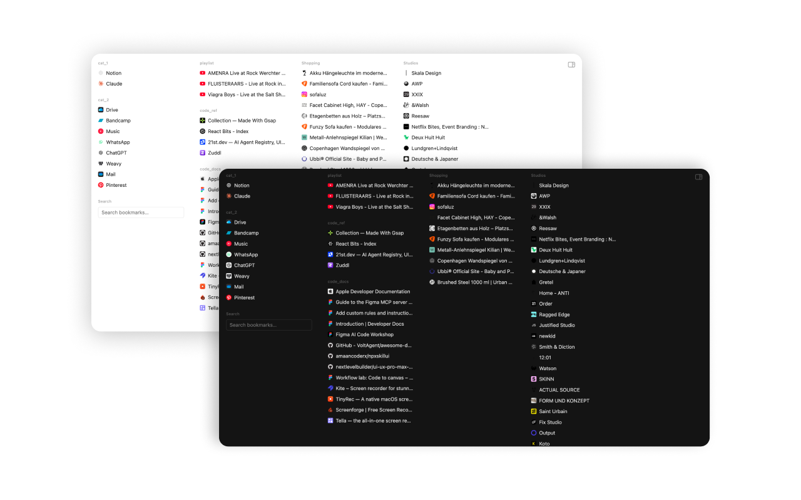

# New Tab Bookmark Columns

A Chrome extension that replaces the new tab page with a clean, customizable bookmark viewer organized in resizable columns.

**Version 1.3.0** — adds opt-in cross-device sync of your column layout and display settings via your Google account (`chrome.storage.sync`).



---

## Features

- **Resizable columns** of bookmark folders, dragged via the dividers between columns
- **Inline edit mode** for arranging columns and folders: per-column drag handle, `+ Add item` menu, `× Remove column`, and a **Done editing** button
- **Drill-down `+ Add item` menu** — browse the whole bookmark tree (including nested subfolders, at any depth) to add any folder or widget to a column; scrolls with the column
- **Drag-and-drop** for bookmarks and folders: reorder inside a folder, move between folders across columns, drop into empty folders, or drag a subfolder onto a column to add it — all with macOS Finder–style horizontal drop indicators
- **Per-column hidden state** — hiding a folder in one column does not affect it in another
- **Subfolders** display inline in their natural order, collapsible with persistent open/closed state
- **Widgets** that share `col.folderIds` with regular folders:
  - **Recently added** — newest bookmarks
  - **Status** — total bookmarks, unique domains, duplicate bookmarks
  - **Search** — instant filter across all bookmarks
- **Themes** — system / light / dark, with a live listener on the system preference
- **Display settings** — toggle bookmark dividers, folder title dividers, column dividers, and hidden items
- **Cross-device sync (opt-in)** — a **Sync** settings toggle (off by default) shares your column layout and display settings across the devices where you enable it, via Chrome's `chrome.storage.sync` (your Google account); per-device by design, with a keep-or-reset prompt when you turn it off. Folders are identified by a re-resolvable reference (root type, account/local subtree, title path), not raw node IDs, so the layout survives cross-device ID differences
- **Favicons** — apple-touch-icon → Chrome favicon fallback, domain-level cache, persisted in `chrome.storage.local`
- **Inline confirmations** for destructive actions (delete folder, delete bookmark)
- **Keyboard** — `Cmd/Ctrl+E` toggles edit mode; `Esc` closes the settings panel, the open `+ Add item` menu, or exits edit mode

---

## Install (development)

1. Clone or download this repo
2. Open `chrome://extensions`
3. Enable **Developer mode** (top right)
4. Click **Load unpacked** and select the project folder
5. Open a new tab

The extension overrides Chrome's new tab page via `chrome_url_overrides`.

---

## Permissions

- `bookmarks` — read and write your Chrome bookmark tree
- `storage` — persist theme, column layout, favicon cache, folder open/closed state, hidden IDs. When you opt into sync, the layout and display settings are stored in `chrome.storage.sync` (synced through your own Google account) instead of locally; the favicon cache and per-device flags always stay local. No new permission is needed for sync.
- `favicon` — fetch site favicons via Chrome's internal `_favicon/` URL

No remote requests are made beyond the per-domain `apple-touch-icon.png` probe used by the favicon fallback chain. Nothing is sent to a third-party server we operate; opt-in sync travels only through Chrome's own sync infrastructure tied to your Google account.

---

## Tech

- Chrome Extension Manifest V3
- Vanilla JS — no frameworks, no build step
- CSS custom properties for the full design token system (color, typography, spacing)
- `chrome.bookmarks` for tree reads and `move`/`update`/`remove`
- `chrome.storage.local` for device-local state (favicon cache, sync opt-in flag, folder open/closed, hidden IDs); `chrome.storage.sync` for the layout + display settings when sync is enabled, with a `storage.onChanged` listener for live cross-device updates
- HTML5 Drag and Drop API + FLIP animations for column / folder / bookmark reorder
- `data-theme` attribute on `<html>` for light/dark switching; system theme uses `window.matchMedia` with a live listener

---

## File structure

```
new-tab/
  manifest.json    — Extension manifest (MV3)
  newtab.html      — Single-page shell, settings panel markup
  newtab.js        — All logic: boot, rendering, drag/drop, context menus, persistence
  newtab.css       — Design tokens, layout, component styles
  icons/           — Extension icons (16, 32, 48, 128 px PNGs)
  CHANGELOG.md     — Versioned changelog
  README.md        — This file
```

---

## Releases

See [CHANGELOG.md](CHANGELOG.md) for the full version history and release notes.

## License

[MIT](LICENSE) © async
